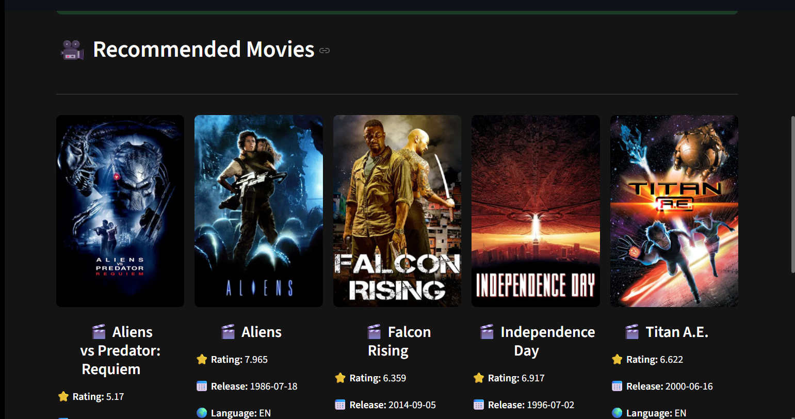

# 🎬 Movie Recommendation System


# 🎬 Movie Recommendation System

An end-to-end **Content-Based Movie Recommendation System** built using **Python**, **Machine Learning**, and **Streamlit**. The application recommends movies similar to a user's selected movie by analyzing movie metadata such as genres, keywords, cast, crew, and overview.

---

## 🚀 Live Demo

> **Coming Soon** (Will be deployed on Streamlit Cloud)

---

## 📌 Project Overview

This project demonstrates how a **Content-Based Recommendation System** works using Natural Language Processing (NLP) techniques and cosine similarity.

Given a movie selected by the user, the application recommends five similar movies along with their posters fetched from the **TMDB API**.

---

## ✨ Features

- 🎥 Recommend top 5 similar movies
- 🖼️ Display movie posters using TMDB API
- ⚡ Fast recommendations using precomputed similarity matrix
- 🌐 Interactive Streamlit web application
- 📚 Clean and user-friendly interface

---

## 🛠️ Tech Stack

### Programming Language
- Python

### Libraries
- Pandas
- NumPy
- Scikit-learn
- NLTK
- Requests
- Streamlit

### Machine Learning
- Count Vectorizer
- Cosine Similarity
- NLP-based Feature Engineering

### Dataset
- TMDB 5000 Movies Dataset

---

## 📂 Project Structure

```text
Movie-Recommendation-System/
│
├── 📄 app.py                                # Streamlit web application
├── 📓 Movie-recommendation-system.ipynb     # Data preprocessing and model building
├── 📦 movies.pkl                            # Processed movie dataset
├── 📄 requirements.txt                      # Project dependencies
├── 📖 README.md                             # Project documentation
├── 📜 LICENSE                               # MIT License
└── 🚫 .gitignore                            # Files ignored by Git
```
```

---

## ⚙️ Installation

Clone the repository

```bash
git clone https://github.com/your-username/Movie-Recommendation-System.git
```

Navigate to the project directory

```bash
cd Movie-Recommendation-System
```

Install dependencies

```bash
pip install -r requirements.txt
```

Run the application

```bash
streamlit run app.py
```

---

## ⚠️ Note

The file **`similarity.pkl`** is **not included** in this repository because it exceeds GitHub's file size limit.

To generate it:

1. Open `Movie_Recommendation_System.ipynb`
2. Run all the notebook cells.
3. This will generate:

```
movies.pkl
similarity.pkl
```

After generating the files, run

```bash
streamlit run app.py
```

---

## 🧠 Machine Learning Workflow

- Data Collection
- Data Cleaning
- Feature Engineering
- Text Preprocessing
- Stemming
- Count Vectorization
- Cosine Similarity
- Recommendation Generation
- Streamlit Deployment

---
## 📸 Screenshots

### 🏠 Home Page

<p align="center">
  
</p>

---

### 🎥 Movie Recommendation

<p align="center">
  
</p>

---

## 📈 Future Improvements

- Hybrid Recommendation System
- Collaborative Filtering
- User Authentication
- Personalized Recommendations
- Movie Search with Auto-complete
- Genre-wise Filtering
- Trending Movies Section
- Deploy on AWS/Render

---

## 📚 Concepts Used

- Content-Based Recommendation
- Natural Language Processing (NLP)
- Feature Extraction
- Cosine Similarity
- Vector Space Model
- API Integration
- Pickle Serialization
- Streamlit Deployment

---

## 🤝 Contributing

Contributions are welcome!

If you have suggestions or improvements, feel free to fork the repository and create a pull request.

---

## 📄 License

This project is licensed under the MIT License.

---

## 👨‍💻 Author

**Arijit Bhattacharyya**

M.Sc. Mathematics & Computing  
IIT (ISM) Dhanbad

📧 Connect with me on LinkedIn!

---

⭐ If you found this project useful, don't forget to **Star** this repository!
